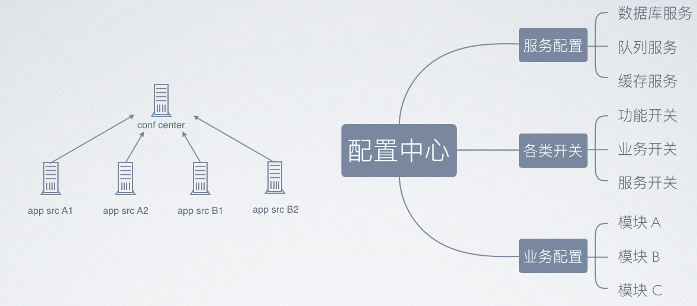

# microservice-examples

## 依赖用途
1.  spring-cloud-eureka  <->  alibaba-nacos <-> consul
- 服务注册与服务发现
- 服务注册中心集群
- 跨平台支持

2. spring-cloud-ribbon
- 负载均衡策略
- 配置: 全局配置，指定服务配置
- 重试机制

3. spring-cloud-hystrix  <->  alibaba-sentinel
- 服务降级
- 服务熔断: 依赖隔离（线程池隔离/信号量隔离）
- 请求缓存
- 请求合并
- 配置: commandKey、groupKey、threadpoolKey，及command，collapser，threadpool属性
- hystrix仪表盘、turbine集群监控、构建监控聚合服务、与消息代理结合

4. spring-cloud-OpenFeign
- 服务调用
- ribbon：负载均衡、全局配置/指定服务配置、重试机制
- hystrix：服务降级、熔断
- 自定义http客户端：HttpUrlConnection、ApacheHttpClient、OkHttpClient等，且这些http客户端支持SSL；
- 请求压缩（GZIP）

5. spring-cloud-zuul <-> spring-cloud-gateway
- 服务网关
- 请求路由: 传统url路由，面向服务路由
- 请求限流: 自定义限流
- 请求记录
- 请求过滤: 请求拦截，安全校验，权限控制，统一签名校验，登录校验等
- hystrix和ribbon支持
- 动态加载、动态路由、动态过滤器

6. spring-cloud-config  <->  alibaba-nacos  <-> 携程Apollo
- 配置中心
- 动态修改配置

在初略了解后，发现spring-cloud-config并不是一个好的选择。推荐[Apollo]或[Nacos]。
（Apollo相比功能更强，但更重量级。另外考虑到alibaba的整套微服务生态，所以建议用nacos）

7. 分布式事务
- alibaba-seata
- dromara-raincat

8. 日志中心
- ELK(elasticsearch + logstash + kibana) 、filebeat

9. 授权服务中心
- spring-security + spring-oauth2

10. 监控中心
- spring-boot-admin
- alibaba-sentinel

11. 其它
- 消息总线: spring-cloud-bus

## 项目说明
## spring-boot-actuator
简单学习服务监控与管理。

## spring-cloud-eureka
基于spring-cloud全家桶大剑的微服务示例，主要依赖：

| name                                       | version                |
| :----------------------------------------- | :---------------------:|
| spring-boot-starter-parent                 | 2.1.4.RELEASE          |
| spring-cloud-netflix                       | 2.0.2.RELEASE          |
| spring-cloud                               | Greenwich.RELEASE      |
| spring-cloud-starter-openfeign             | 2.1.0.RELEASE          |
| spring-cloud-starter-gateway               | 2.1.0.RELEASE          |
| spring-boot-starter-actuator               |                        |
| spring-cloud-starter-netflix-eureka-server |                        |
| spring-cloud-starter-netflix-eureka-client |                        |
| spring-cloud-starter-netflix-ribbon        |                        |

## spring-cloud-alibaba
服务注册中心由`spring-cloud-eureka`替换为`nacos`，并且使用`nacos`作为配置中心。

| name                                       | version                |
| :----------------------------------------- | :---------------------:|
| spring-boot-starter-parent                 | 2.1.4.RELEASE          |
| spring-cloud-netflix                       | 2.0.2.RELEASE          |
| spring-cloud                               | Greenwich.RELEASE      |
| spring-cloud-starter-openfeign             | 2.1.0.RELEASE          |
| spring-cloud-starter-gateway               | 2.1.0.RELEASE          |
| nacos                                      | 0.9.0.RELEASE          |

## 备注
### 微服务整体架构
- [谈谈微服务中的 API 网关（API Gateway）](https://www.cnblogs.com/savorboard/p/api-gateway.html)
- [微服务架构实践（API Gateway）](https://www.oschina.net/question/3573545_2282934)

### 配置中心技术选择
因为可能现在微服务架构会抛弃spring-cloud或者spring-cloud-netflix。取而代之的是spring-cloud-alibaba。
Nacos整合了服务的注册发现，和配置中心。可能现在更多的是选择Nacos来实现。

Apollo vs spring-cloud-config：

分布式配置中心参考：

## 概念
1. CAP定理
[阮一峰 - CAP 定理的含义](http://www.ruanyifeng.com/blog/2018/07/cap.html)
Consistency（一致性）、 Availability（可用性）、Partition tolerance（分区容错性），三者只可得其二。

2. 脏读、不可重复读、幻读、第一类丢失更新、第二类丢失更新
[事务并发的问题](https://blog.csdn.net/dingguanyi/article/details/80888441)

3. 事务隔离级别：Read-uncommitted、Read-committed、Repeatable-read、Serializable
[数据库隔离级别](https://my.oschina.net/bigdataer/blog/1976010)

| isolation               | dirty read   | unrepeatable read | phantom read |
| :-----------------------| :----------: | :---------------: | :-----------:|
| Read uncommitted        | √            | √                 | √            |
| Read committed(oralce)  | ×            | √                 | √            |
| Repeatable read(mysql)  | ×            | ×                 | √            |
| Serializable            | ×            | ×                 | ×            |

4. 事务的基本特性：ACID
  原子性（Atomicity）：事务开始后所有操作，要么全部做完，要么全部不做，不可能停滞在中间环节。事务执行过程中出错，会回滚到事务开始前的状态，所有的操作就像没有发生一样。
  一致性（Consistency）：事务开始前和结束后，数据库的完整性约束没有被破坏 。比如A向B转账，不可能A扣了钱，B却没收到。
  隔离性（Isolation）：同一时间，只允许一个事务请求同一数据，不同的事务之间彼此没有任何干扰。比如A正在从一张银行卡中取钱，在A取钱的过程结束前，B不能向这张卡转账。
  持久性（Durability）：事务完成后，事务对数据库的所有更新将被保存到数据库，不能回滚。

5. 分布式事务: TCC、XA、2PC

6. 授权中心设计: JWT、Oauth2
[JAVA商城项目（微服务框架）— 授权中心](https://blog.csdn.net/qq_33591055/article/details/88876772)

7. 分布式事务
[alibaba seata](https://github.com/seata/seata)
[raincat、hmily](https://dromara.org/website/zh-cn/)

## 参考
- [Apollo Github][Apollo]
- [Nacos Github][nacos]
- [spring-cloud-alibaba Github][spring-cloud-alibaba]
- spring-cloud微服务实战，翟永超著（2017年5月第1版，电子工业出版社）

[Apollo]: https://github.com/ctripcorp/apollo
[Nacos]: https://github.com/alibaba/nacos
[spring-cloud-alibaba]: https://github.com/spring-cloud-incubator/spring-cloud-alibaba