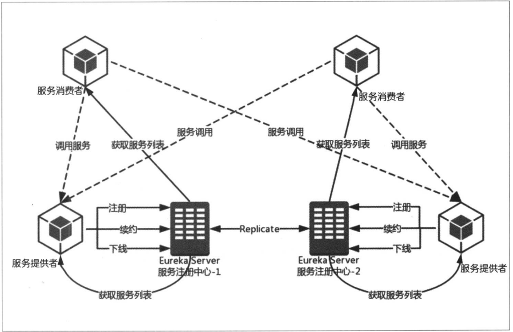

# 【01】服务治理

## 1. 服务治理
- alibaba-nacos（AP）
- spring-cloud-eureka（AP）
- consul（CP）
- etcd、zookeeper、feature等

强一致性(C)带来的是：
  - 服务注册相比Eureka会稍慢一些。因为Consul的raft协议要求必须过半数的节点都写入成功才认为注册成功。
  - Leader挂掉时，重新选举期间整个consul不可用。保证了强一致性但牺牲了可用性。
  - consul也提供了较高的可用性，相比zookeeper、etcd可用性更高。

保证高可用(A)和最终一致性：
  - 服务注册相对要快，因为不需要等注册信息replicate到其他节点，也不保证注册信息是否replicate成功
  - 当数据出现不一致时，虽然A, B上的注册信息不完全相同，但每个Eureka节点依然能够正常对外提供服务，这会出现查询服务信息时如果请求A查不到，但请求B就能查到。如此保证了可用性但牺牲了一致性。

eureka缺陷： 
  因为server之间是replicate，每个server都保存完整的服务注册信息，若当服务注册信息足够大时，会很消耗服务器资源。
  （甚至服务注册信息超过单机限制）

需要注意的问题：
  因为eureka是最终一致性，所以在服务注册信息同步期间，可能访问到不可访问的服务或无法访问新加的服务。
  虽然，可以缩短服务同步的间隔，但会增加服务器压力，可以具体情况考虑配置的参数设置。

### 为什么需要服务治理模块？
服务治理模块主要负责完成微服务架构中的服务治理功能：服务注册中心、服务注册与服务发现。

> 在最初开始构建微服务系统的时候可能服务并不多，我们可以通过做一些静态配置来 完成服务的调用。 
  比如，有两个服务A和B, 其中服务A需要调用服务B来完成一个业务操作时，为了实现服务B的高可用，不论采用服务端负载均衡还是客户端负载均衡， **都需 要手工维护服务 B 的具体实例清单**。 
但是随着业务的发展，系统功能越来越复杂，相应的微服务应用也不断增加，我们的静态配置就会变得越来越难以维护。 
  并且面对不断发展的业务， 集群规模、服务的位置、服务的命名等都有可能发生变化，如果还是通过手工维护的方式，那么极易发生错误或是命名冲突等问题。 
同时， 对于这类静态内容的维护也必将消耗大量的人力。

1. 服务注册
  在服务治理框架中， 通常都会构建一个注册中心， 每个服务单元向注册 中心登记自己提供的服务， 将主机与端口号、 版本号、 通信协议等一些附加信息告 知注册中心， 注册中心按服务名分类组织服务清单。
  当服务单元启动时， 会向注册中心注册自己的服务， 注册中心就会维护一个服务清单。 
  另外， 服务注册中心还会以心跳的方式去监测清单中的服务是否可用， 若不可用 则从服务清单中剔除， 达到排除故障服务的效果。
  
2. 服务发现
  由于在服务治理框架下运作，服务间的调用不再通过指定具体的实例地 址来实现， 而是**通过向服务名发起请求调用实现**。 所以， 服务调用方在调用服务提供方接口的时候， 并不知道具体的服务实例位置。
  当服务要发起调用的时候，会从清单中以**某种轮询策略**取出一个位置来进行服务调用， 这就是客户端负载均衡。
  备注：
    1. 服务调用的策略不一定是轮询策略，可能还有区域选择策略等。
    2. 实际的框架为了性能等因素，不会采用每次都向服务注册中心获取服务的方式，并且不同的应用场景在缓存和服务剔除等机制上也会有一些不同的实现策略。
  
3. 服务治理机制​​

- 服务注册
- 服务续约
- 服务下线
- 获取服务列表
  当启动"服务消费者"时，它会发送一个REST请求给服务注册中心，来获取上面注册的服务清单。
  eureka-server会维护一份只读的服务清单返回给客户端。同时该缓存清单会每隔`eureka.client.registry-fetch-interval-seconds`更新一次。

- 服务调用
  服务消费者在获取清单后，通过服务名可以具体获得提供服务的实例名和该实例的metadata信息。
  因为有这些服务实例的详细信息，所以客户端可以根据自己的需要决定调用哪个实例，在Ribbon中会默认采用轮询的方式调用。但也可以指定区域调用（就近原则）。

- 服务同步
- 失效剔除
- 自我保护